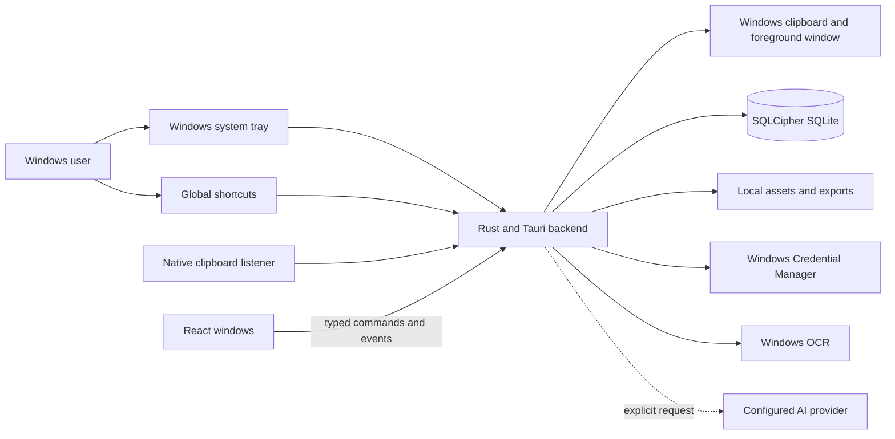
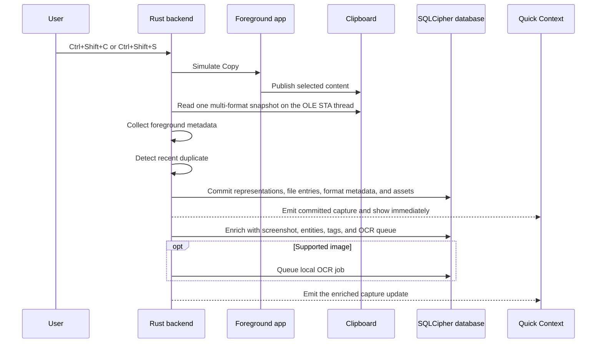

# ScryPuppy architecture

This document describes the Windows-first ScryPuppy 1.0 Beta implementation. The repository is the source of truth; update this file whenever command boundaries, persistence, window behavior, packaging, or security assumptions change.

## System overview



ScryPuppy runs as one Tauri process with a React frontend and Rust backend. Rust owns clipboard access, operating-system metadata, persistence, encryption, OCR, global shortcuts, native window behavior, and AI adapters. The frontend receives only the domain data required to render each surface.

## Application surfaces

Window definitions live in `src-tauri/tauri.conf.json`.

| Surface | Label | Purpose | Behavior |
| --- | --- | --- | --- |
| Main workspace | `main` | Browse captures, Contexts, documents, and Settings | Standard 1100×720 window; closing hides it while the tray process remains available |
| Quick Paste | `paste` | Search and paste clipboard history | Frameless, always on top, keyboard focused |
| Quick Context | `quick-context` | Associate a newly saved capture | Frameless, always on top, avoids stealing focus initially |
| Ask ScryPuppy | `magic-search` | Return a focused answer or create a cited document | Frameless, resizable, always on top |

`src/App.tsx` selects the UI by Tauri window label. Secondary windows render only their own focused React tree and do not load the complete main workspace.

Each secondary window has a minimal capability file in `src-tauri/capabilities/`. Only the main window receives autostart access.

## Source map

### Frontend

- `src/features/lite/LiteMainApp.tsx` — context-first capture and document workspace.
- `src/features/lite/LiteMagicPalette.tsx` — quick answers and cited document creation.
- `src/features/lite/LiteDocumentsWorkspace.tsx` — editable Markdown, versions, and evidence management.
- `src/features/lite/AddItemsToContextDialog.tsx` — local filtering and transactional multi-assignment.
- `src/features/lite/CaptureDetailsDialog.tsx` — source metadata, Context membership, assets, and OCR.
- `src/components/OnboardingTutorial.tsx` — six-step first-run and replayable onboarding.
- `src/components/SettingsControls.tsx` — shared controls used by Settings and onboarding.
- `src/hooks/useSettingsCoordinator.ts` — optimistic settings state and serialized persistence.
- `src/api/tauri.ts` — typed frontend command boundary.
- `src/appMessages.ts` — stable message-code catalog, Tauri error normalization, and legacy compatibility adapter.
- `src/types.ts` — frontend domain contracts.
- `src/i18n.ts` — English source strings and Brazilian Portuguese translations.
- `src/dev/docsPreview.ts` — development-only, synthetic data bridge for reproducible documentation screenshots.

### Native backend

- `src-tauri/src/lib.rs` — commands, database initialization, migrations, capture orchestration, OCR scheduling, Windows integration, and window lifecycle.
- `src-tauri/src/app_error.rs` — serializable command errors, non-error notices, safe parameters, and the isolated legacy domain-error bridge.
- `src-tauri/src/clipboard_monitor.rs` — Windows message-only listener, sequence handling, queue, and persistence worker.
- `src-tauri/src/ai.rs` — provider catalog and AI adapters.
- `src-tauri/src/crypto.rs` — export encryption and hashing helpers.
- `src-tauri/src/main.rs` — process entry point.

The frontend deliberately uses React state and hooks rather than a second global state framework.

## Error and localization contract

Tauri commands return structured errors instead of localized prose:

```json
{
  "code": "file.not_found",
  "params": { "path": "C:\\missing.md" }
}
```

The backend owns error classification and may include only display-safe parameters. Technical causes are logged without clipboard content, credentials, or other sensitive values and are never serialized to the webview. Non-error warnings use the same `code`/`params` shape through a distinct notice type.

The frontend normalizes every `invoke` rejection in `src/api/tauri.ts`, resolves the code through `src/appMessages.ts`, and applies the selected locale only at the presentation boundary. UI copy in `src/i18n.ts` never attempts to identify backend errors by comparing sentences. A small legacy adapter recognizes errors emitted by older installed binaries and can be removed after that compatibility window ends.

App-generated capture labels are derived from structured representations and file entries. `content_text` is the safe searchable fallback; it is never the source of truth for restoring rich content or files.

## Capture pipeline

### Explicit capture



Important guarantees:

- The capture exists before Quick Context is opened.
- Closing Quick Context never discards a capture.
- Duplicate or failed captures do not open Quick Context.
- Internal clipboard writes and Quick Paste restoration do not create captures.
- A capture ID and generation guard prevent delayed overlay events from mutating the wrong record.
- Screenshot capture, deterministic analysis, OCR queueing, and encrypted Context-file synchronization run after the overlay becomes available, so they do not delay its first paint.

### Windows tray lifecycle

The Tauri process creates one tray icon from the configured ScryPuppy application icon. A left click restores and focuses the main window. The native menu can also open the workspace or quit the application. Closing the main window only hides it; **Quit ScryPuppy** shuts down the clipboard listener and calls Tauri's process-level exit API.

### Optional clipboard monitor

`WM_CLIPBOARDUPDATE` is handled on a dedicated Windows message-only thread. The listener starts from the current clipboard sequence number, collects active-window metadata, and asks a dedicated OLE STA service for one immutable snapshot. It never simulates a keyboard copy.

The snapshot can preserve `CF_UNICODETEXT`, HTML, RTF, URL, `CF_DIBV5`, physical file/folder drops, and shell virtual files. Unknown registered formats are recorded by name and ID but their private bytes are never ingested blindly. Quick Paste reconstructs all restorable representations and publishes them together, including `Preferred DropEffect=COPY` for file lists.

Physical files, folders, shortcuts, and executables remain references to their original paths. Executables are never launched. Virtual files such as Outlook attachments are bounded, sanitized, and materialized atomically under `assets/clipboard-files/<capture-id>/`. UNC paths are not statted during capture, preventing a passive clipboard event from initiating a network lookup.

Explicit hotkeys and automatic copies share the same persistence path. Automatic copies always use the regular capture kind, enter the unassigned collection, and record their origin in metadata.

| Origin | Screenshot policy | Quick Context policy |
| --- | --- | --- |
| Explicit regular capture | `capture_screenshots` | `quick_context_enabled` |
| Explicit reference | Reference behavior | Global toggle plus `quick_context_after_reference` |
| Clipboard monitor | `clipboard_monitor_capture_screenshots` | Global toggle plus `clipboard_monitor_quick_context_enabled` |
| File import | No clipboard screenshot | Never opens Quick Context |

Automatic monitoring and both automatic side effects default to off.

## Persistence model

The encrypted SQLite schema is created and evolved in `migrate()`.

| Table | Responsibility |
| --- | --- |
| `captures` | Content, hashes, timestamps, source metadata, platform, and capture kind |
| `capture_assets` | Clipboard images, imported images, screenshots, status, and local paths |
| `capture_representations` | Ordered text, HTML, RTF, URL, image, and file-list representations used for lossless restore |
| `capture_file_entries` | Physical references and materialized virtual files with kind, integrity, availability, and size |
| `capture_clipboard_formats` | Supported and unsupported Windows clipboard format metadata |
| `contexts` | User-managed normalized Contexts |
| `capture_contexts` | Many-to-many Context assignments with origin and confidence |
| `capture_tags` | Deterministic content descriptors |
| `capture_entities` | URLs, paths, applications, hashes, UUIDs, and other anchors |
| `capture_ocr` | Latest OCR result for each capture |
| `ocr_jobs` | Recoverable background OCR queue |
| `settings` | Local preferences and onboarding completion |
| `magic_search_documents` | Versioned generated Markdown and saved filters |
| `magic_search_evidence` | Durable ranked evidence snapshots |

`capture_contexts` uses `(capture_id, context_id)` as its primary key, so repeated assignments are idempotent. Deleting a Context removes associations but not capture records.

The Lite workspace exposes **Everything**, user-created Contexts, and Documents. The multi-format schema is intentionally a breaking contract: there is no legacy representation adapter or backfill path.

## Context organization

Users can create a Context, assign it from capture details, or add several existing captures through a local-only picker. Bulk assignment is validated and committed in one Rust transaction.

The backend retains deterministic and optional AI-assisted organization for compatibility. Local analysis considers URLs, repositories, applications, window titles, paths, commands, hashes, UUIDs, tags, entities, existing Contexts, and temporal proximity. Suggestions are reviewable and never remove manual associations.

Optional AI receives bounded safe text and metadata only. Binary payloads and complete file paths are excluded. Images and screenshots are excluded, relevant redacted OCR text is treated as text evidence, and local results remain available if a provider fails.

## Search and documents

- Local Search filters stored captures without an external request.
- Ask ScryPuppy ranks local evidence before invoking an explicitly configured provider.
- Quick-answer mode returns a focused result with its evidence.
- Document mode creates editable, versioned Markdown with numbered sources.
- Evidence snapshots remain durable so a document keeps its source trail.
- Export uses the native save dialog and is performed locally by a Rust command at the path explicitly chosen by the user.

The Ask ScryPuppy webview remains alive while hidden. Contexts are refreshed on every `magic-search-opened` event, not only at React mount. Removed Context selections are reset before preview or generation.

## Settings and onboarding

Settings use a typed `Settings`/`SettingsDto` contract backed by the encrypted database. Sensitive AI key material is not returned in ordinary frontend state; only a configured flag is exposed.

`onboarding_completed` is paired with `onboarding_completed_version`. The welcome opens when the installed version differs from the last completed version. Replaying it from Settings does not reset data, defaults, credentials, or completion state.

All plugins and managed state required by startup commands are registered before the first webview is created. Settings commands use non-panicking state access as a defensive fallback.

## Security boundaries

- SQLite records are encrypted with bundled SQLCipher.
- Database and AI credentials use Windows Credential Manager.
- Encrypted Context exports use AES-256-GCM.
- Clipboard content is not sent externally by default.
- AI requires an explicit user action.
- Images and screenshots are excluded from AI requests.
- File bytes, executable contents, private clipboard formats, and complete filesystem paths are excluded from AI requests.
- Stored HTML is never rendered directly; the UI uses its plain-text fallback.
- Virtual file names are sanitized, per-file and per-capture byte limits are enforced, and incomplete `.part` files are removed during startup recovery.
- Recognized credentials in queries, capture text, metadata, entities, and OCR text are replaced before every provider call. Magic Search uses opaque placeholders backed by an in-memory map; document mode restores them only after the response returns locally. The map is never sent or persisted.
- Evidence excerpts remain redacted. A generated or exported document can contain restored credentials, so it must be handled as sensitive local data.
- Clipboard content and credentials must never be written to logs.
- No analytics or telemetry are included.

## Build and packaging

The supported Windows build is:

```powershell
npm run build:windows
```

The script compiles the Vite frontend, builds Tauri with `custom-protocol`, recompiles a clean locked Rust release, performs a 12-second startup check, and packages one multilingual NSIS installer.

Artifacts are written under `src-tauri/target/release/bundle/`. See [docs/windows-build.md](docs/windows-build.md) for the release guardrails.

## Change checklist

When changing a command, setting, or domain contract:

1. Add or reuse a stable backend error/notice code; never return localized prose from a command.
2. Include only display-safe structured parameters and keep technical causes in backend logs.
3. Update Rust DTOs and persistence.
4. Update `src/types.ts` and the catalog in `src/appMessages.ts`.
5. Keep calls behind `src/api/tauri.ts`.
6. Add English and Brazilian Portuguese UI strings.
7. Review window-specific capabilities.
8. Review privacy defaults and migration behavior.
9. Run frontend compilation, frontend tests, Rust checks, Rust tests, and the production Windows build when applicable.
