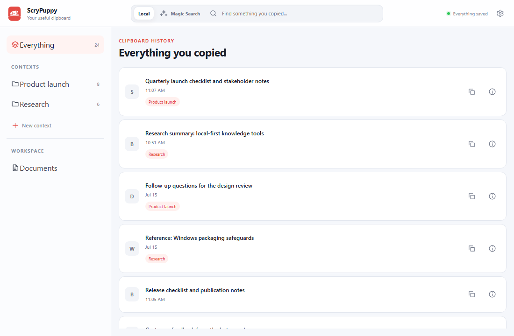
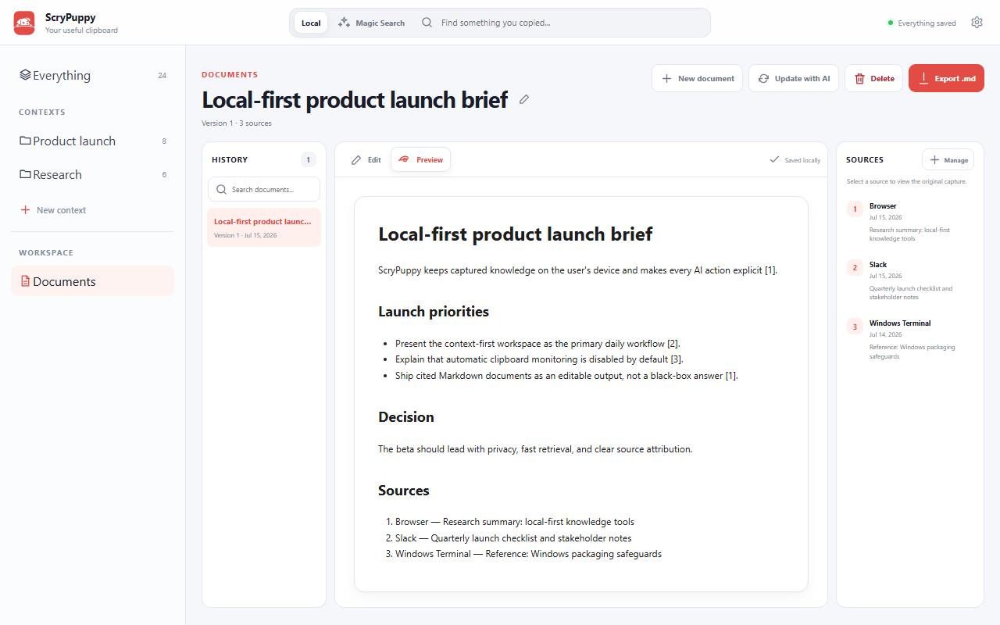
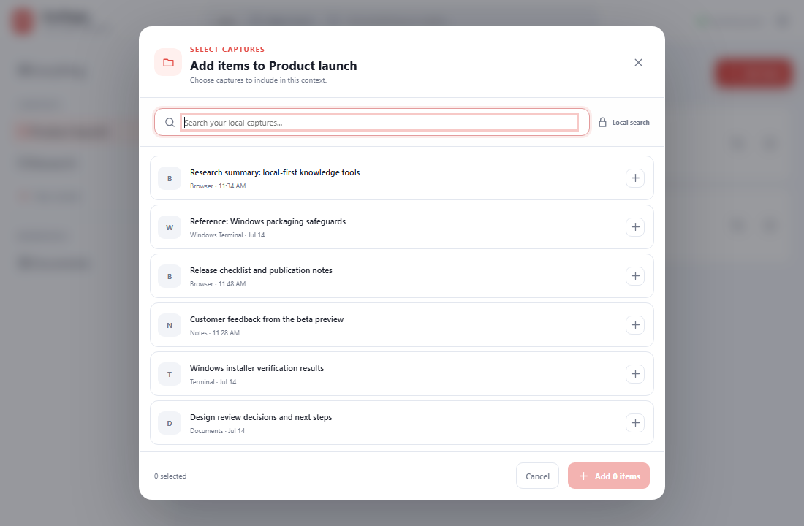
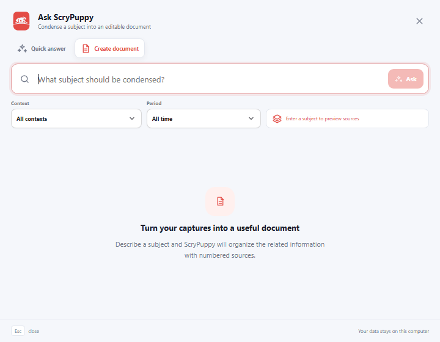
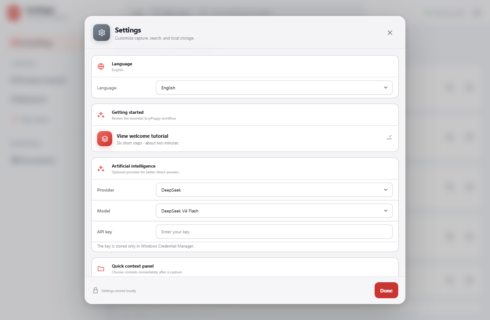
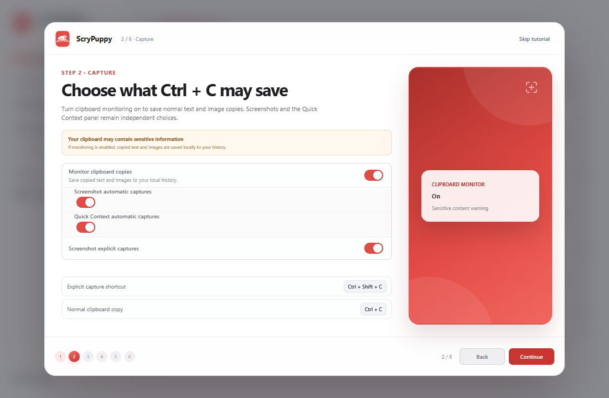
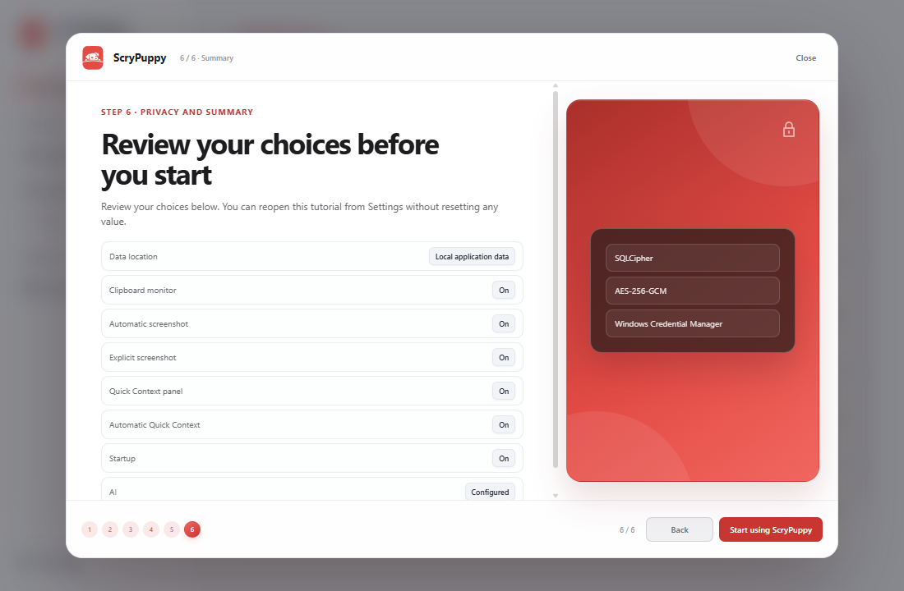

<div align="center">

# ScryPuppy

### A private, context-aware clipboard companion for Windows

Capture useful information, keep its source, organize it into Contexts, and turn related captures into cited documents without giving up local control.

[](https://github.com/Lucas-Damasceno/ScyPuppy/releases)
[](LICENSE)
[](https://v2.tauri.app/)
[](https://react.dev/)
[](#install)

[Download](https://github.com/Lucas-Damasceno/ScyPuppy/releases) · [Build from source](#build-from-source) · [Architecture](ARCHITECTURE.md) · [UI reference](prints.md)

</div>

> [!NOTE]
> ScryPuppy 1.0 is in beta. The current package version is `1.0.0-beta.2`.



## What ScryPuppy does

ScryPuppy turns selected clipboard content into a private, searchable knowledge layer:

1. **Capture** selected text or images with their source application and window metadata.
2. **Organize** a capture into one or several reusable Contexts.
3. **Retrieve** previous content through local search or Quick Paste.
4. **Condense** related captures into editable Markdown documents with numbered sources.

Automatic clipboard monitoring is optional and disabled by default. Local capture, search, Contexts, OCR, Quick Paste, and document storage do not require an AI provider.

## Product tour

### Build source-linked documents

Ask ScryPuppy can gather related captures into a Markdown document that remains editable. Citations use numbered evidence, and every source can be opened from the document workspace.



### Add existing captures to a Context

The Context picker searches only the local encrypted library. It supports filtering and multi-selection without exposing Magic Search inside the organization flow.



### Ask a focused question or create a document

Quick answers and document creation are separate modes. Document mode adds Context, time period, and evidence preview controls before generation.



### Configure one consistent settings model

Settings and onboarding share the same controls for language, AI, clipboard behavior, Quick Context, startup, shortcuts, and local-data management.



See [prints.md](prints.md) for the complete UI reference and onboarding gallery.

## Highlights

- Explicit shortcuts for regular captures and durable references.
- Optional native monitoring for ordinary Windows clipboard copies.
- Text, image, source application, window metadata, and local OCR support.
- Many-to-many Context organization: one capture can belong to several Contexts.
- Unified Local Search and Magic Search entry point.
- Quick Paste history available from any application.
- Editable, versioned Markdown documents with durable evidence snapshots.
- SQLCipher database encryption and Windows Credential Manager integration.
- English and Brazilian Portuguese interface.
- No analytics or telemetry.

## Privacy model

- Captures, Contexts, tags, entities, generated documents, images, and OCR results are stored locally.
- The SQLite database is encrypted with SQLCipher.
- Database and AI credentials are stored in Windows Credential Manager.
- AI is invoked only after an explicit user action.
- Images and screenshots are never sent to AI providers.
- Explicit AI requests may include bounded text evidence and relevant locally extracted OCR text. Recognized API keys and tokens are replaced with opaque placeholders before every provider request.
- For generated documents, placeholders are restored only after the provider response returns, on the user's device. Local documents and exported Markdown files may therefore contain the original credentials and should be handled carefully.
- Automatic screenshots and automatic Quick Context prompts remain separate opt-ins.

> [!IMPORTANT]
> If clipboard monitoring is enabled, ordinary copied text or images may be retained locally, including credentials or confidential content. Review the library regularly and enable only the automatic behaviors you need.

The exact application-data directory is shown in Settings. During uninstall, the user can choose whether to keep or remove ScryPuppy data.

## Shortcuts

| Shortcut | Action |
| --- | --- |
| `Ctrl + Shift + C` | Save a regular capture |
| `Ctrl + Shift + S` | Save a durable reference |
| `Ctrl + Shift + V` | Open Quick Paste history |

After an explicit capture, Quick Context can assign one or several Contexts. The capture is saved before that panel appears, so dismissing the panel never discards it.

## Install

Download the latest prerelease from the [Releases page](https://github.com/Lucas-Damasceno/ScyPuppy/releases).

Requirements:

- Windows 10 or Windows 11 x64.
- Microsoft Edge WebView2 Runtime.
- The multilingual NSIS `.exe` installer provided with the release.

## Build from source

Install Node.js with npm, Rust, and the [Tauri Windows prerequisites](https://v2.tauri.app/start/prerequisites/).

```powershell
git clone https://github.com/Lucas-Damasceno/ScyPuppy.git
cd ScyPuppy
npm install
npm run tauri dev
```

Create the production Windows installer with:

```powershell
npm run build:windows
```

Do not replace this command with a plain `cargo build --release`. The release script enables Tauri's `custom-protocol`, validates startup, and packages the supported NSIS installer. See [docs/windows-build.md](docs/windows-build.md).

Artifacts are written to:

```text
src-tauri/target/release/bundle/nsis/
```

## Technical stack

| Layer | Technology |
| --- | --- |
| Desktop runtime | Tauri 2 |
| Frontend | React 19, TypeScript, Vite |
| Native backend | Rust |
| Local database | SQLite with bundled SQLCipher |
| Export encryption | AES-256-GCM |
| Credentials | Windows Credential Manager |
| Clipboard and input | `arboard`, `enigo` |
| Window capture | `xcap` |
| OCR | Windows Media OCR APIs |

Read [ARCHITECTURE.md](ARCHITECTURE.md) for command boundaries, windows, persistence, capture sequencing, and security decisions.

<details>
<summary><strong>First-run onboarding</strong></summary>

The six-step welcome explains capture, Contexts, retrieval, personalization, and privacy. It reappears after installing a new version and can be opened at any time from **Settings → Getting started**.

<table>
  <tr>
    <td width="50%"></td>
    <td width="50%"></td>
  </tr>
</table>

</details>

## Support the project

If ScryPuppy saves you time and you would like to support its development, you can donate through PayPal:

<div align="center">

[](https://www.paypal.com/donate/?business=GNSP2TYN4L8NJ&no_recurring=0&item_name=If+ClipScry+saves+you+time%2C+consider+supporting+its+development.%20Every+donation+helps+keep+the+project+growing&currency_code=USD)

</div>

## Contributing

Contributions are welcome, especially around accessibility, Windows compatibility, OCR, performance, migration safety, provider maintenance, and UI polish.

1. Fork the repository.
2. Create a focused branch.
3. Explain the user impact of the change.
4. Run the relevant compile and build checks.
5. Include screenshots for visual changes.

Never commit captured user data, API keys, databases, application-data folders, or credentials.

## License

ScryPuppy is distributed under the [GNU Affero General Public License v3.0](LICENSE).

---

<div align="center">

Some dogs watch data. This one watches your clipboard.

</div>
