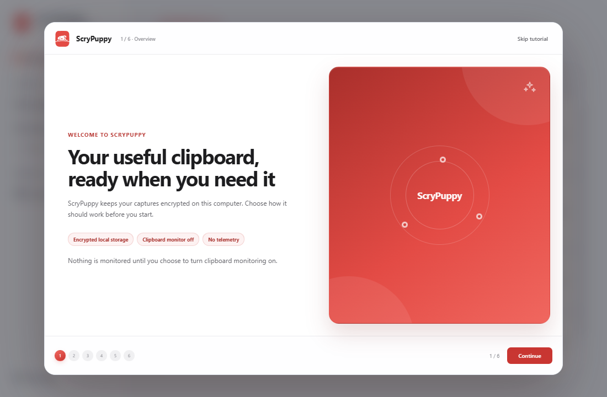
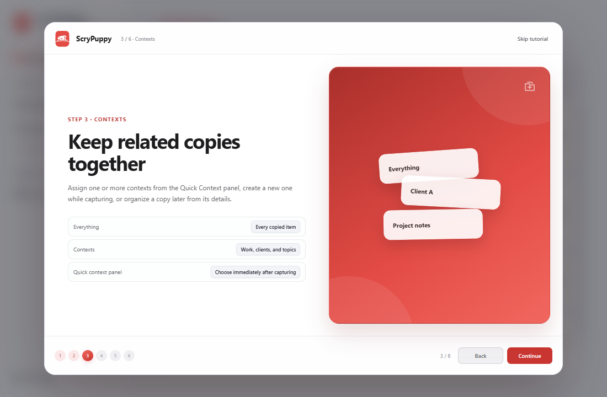
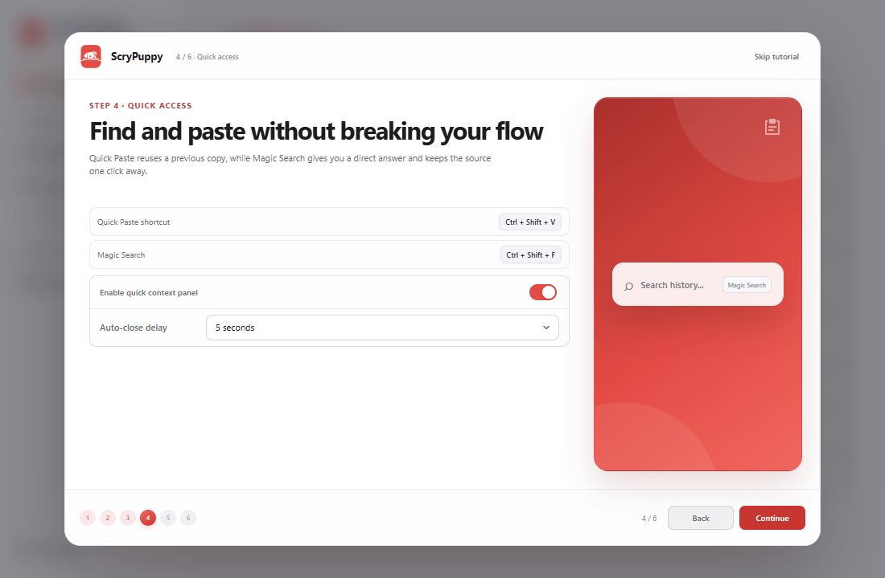
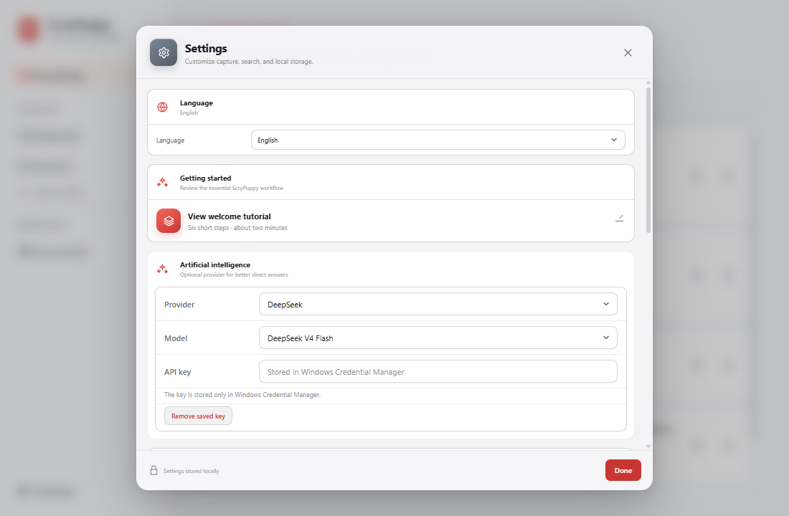

# ScryPuppy 1.0 Beta UI reference

This gallery documents the public interface and the UX rules behind its main workflows. Screenshots use the English interface, synthetic content, and no credentials or private clipboard data.

## Main workspace


- Keep the brand, unified search, save state, and Settings in one stable header.
- Make **Everything**, Contexts, and Documents visible without crowding the capture list.
- Use the red brand tokens consistently for selection, focus, and primary actions.
- Keep capture actions discoverable while allowing the content itself to remain the visual priority.

## Cited document workspace


- Separate document history, editable content, and numbered sources into three predictable regions.
- Keep Edit and Preview as explicit modes.
- Make local save state visible without interrupting the workflow.
- Allow every numbered source to open its original capture.
- Keep export, AI update, rename, version cleanup, and deletion distinct by risk and frequency.

## Add captures to a Context


- Open from **Add items** in a selected Context.
- Search only the encrypted local library; Magic Search is intentionally absent.
- Preserve multi-selection while the user refines the query.
- Keep the selected count and final action together in the footer.

## Smart Contexts and selective cleanup

- Open **Automation** only from a selected Context so every rule has an obvious destination.
- Preview existing rule matches without changing assignments, then make backfilling an explicit opt-in.
- Keep all rule evaluation local and explain that OCR can complete a match later.
- Put cleanup at the far right of the capture workspace title actions and require a filter preview plus a second confirmation.
- Show the exact capture count, content breakdown, Context scope, and estimated reclaimed space before permanent deletion.

## Ask ScryPuppy


- Separate quick answers from document creation with two explicit modes.
- Show up to five ranked evidence items for quick answers and let every item open its original capture.
- Refresh the Context selector every time the window opens.
- Keep Context, time period, and evidence preview close to the prompt.
- Use a borderless internal shell because Windows supplies the outer window shape.

## Settings


- Use a conventional cog for the Settings entry and dialog identity.
- Make Local beta and AI provider an explicit radio choice with the active engine visible at a glance.
- Keep model download, indexing, retry, and removal states inside the standard settings row system.
- Reuse the same controls as onboarding so values behave consistently.
- Standardize group borders, dividers, row heights, input sizes, and focus states.
- Keep destructive local-data actions visually separated from everyday preferences.
- Never display a real API key in documentation.

## Onboarding

The six-step welcome is supporting documentation rather than the primary product gallery. It appears when the installed version has not been completed and remains available from **Settings → Getting started**.

<table>
  <tr>
    <td width="50%"></td>
    <td width="50%"></td>
  </tr>
  <tr>
    <td></td>
    <td></td>
  </tr>
  <tr>
    <td></td>
    <td></td>
  </tr>
</table>

The flow should:

- Explain local-first behavior before presenting configuration.
- Teach explicit capture, durable references, Quick Paste, and Context assignment.
- Show that clipboard monitoring and its automatic side effects are off by default.
- Keep progress visible and allow keyboard navigation.
- Save pending values safely before Skip, Escape, Close, or completion.
- Replay without resetting data, defaults, credentials, or completion state.

## Reproducing documentation screenshots

Development builds include a synthetic preview bridge in `src/dev/docsPreview.ts`. It is enabled only when Vite runs in development mode and the `docs-preview` query parameter is present. The preview never reads the local database or clipboard.

Start the frontend:

```powershell
npm run dev -- --host 127.0.0.1 --port 4173
```

Then open the relevant URL at the documented viewport:

| Screenshot | URL | Viewport |
| --- | --- | --- |
| Main workspace | `http://127.0.0.1:4173/?docs-preview=main` | 1100×720 |
| Context picker | `http://127.0.0.1:4173/?docs-preview=context-picker` | 1100×720 |
| Smart Contexts | `http://127.0.0.1:4173/?docs-preview=smart-context` | 1100×720 |
| Selective cleanup | `http://127.0.0.1:4173/?docs-preview=cleanup` | 1100×720 |
| Documents | `http://127.0.0.1:4173/?docs-preview=documents` | 1280×800 |
| Settings | `http://127.0.0.1:4173/?docs-preview=settings` | 1100×720 |
| Ask ScryPuppy | `http://127.0.0.1:4173/?docs-preview=ask-document&window-label=magic-search` | 720×560 |

Before committing replacements, verify that every image is in English, contains only synthetic data, matches the current design tokens, and renders correctly in both this file and `README.md`.
